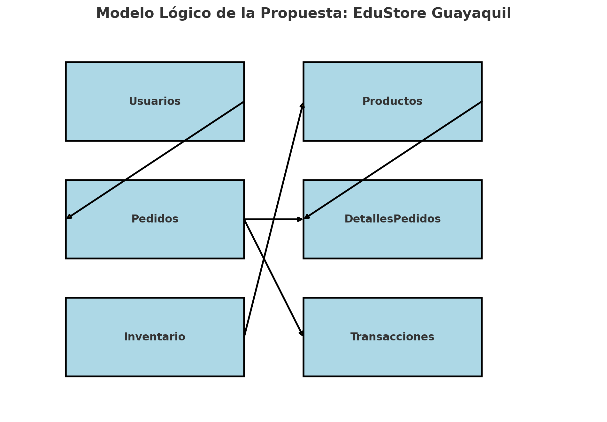

 # appSigeVAE
EduStore Guayaquil es una iniciativa orientada a la creación de una plataforma de venta y gestión de artículos escolares en la ciudad de Guayaquil. El proyecto tiene como objetivo principal ofrecer una solución eficiente para la compra y administración de materiales educativos, facilitando tanto a los padres como a las instituciones educativas el acceso a productos de calidad a precios competitivos.

# Catalogo de Productos

* Útiles básicos: cuadernos, lápices, bolígrafos, borradores, sacapuntas, reglas, tijeras.
* Material didáctico: cartulinas, papeles de colores, pegamentos, plastilinas.
* Equipos tecnológicos: calculadoras, tabletas, laptops.
* Accesorios escolares: mochilas, loncheras, estuches.
* Libros y cuadernos: libros de texto, cuadernos especializados.
* Mobiliario escolar: escritorios, sillas, estanterías.

# Modelo Relacional

**Tablas Principales:**

* Usuarios: Almacena información sobre los usuarios registrados (padres, estudiantes, personal educativo).
* Productos: Contiene detalles sobre los artículos escolares disponibles para la venta.
* Pedidos: Registra los pedidos realizados por los usuarios.
* DetallesPedidos: Detalles específicos de cada pedido, incluyendo los productos y cantidades.
* Inventario: Gestión del inventario de productos.
* Transacciones: Información sobre las transacciones de pago realizadas.

NOTE: Podrá descargar el scrip con el modelo fisico [Modelo Fisico](BD/educaStore.sql).

# Desarrollo de propuesta
Para esta propuesta se ha considerado los suguientes aspectos que se automatizará

* Registro de Usuarios: Sistema de registro y autenticación de usuarios para padres, estudiantes y personal de instituciones educativas.
* Gestión de Pedidos: Módulo para la realización, seguimiento y gestión de pedidos, incluyendo opciones de entrega y retiro en tienda.
* Base de Datos Relacional: Implementación de una base de datos relacional que contenga tablas para productos, usuarios, pedidos, inventarios y transacciones.
* Interfaz de Administración: Panel de control para la administración de productos, categorías, precios, promociones y gestión de inventario.
* Integración de Métodos de Pago: Soporte para pagos mediante tarjetas de crédito, débito, transferencias bancarias y pagos en efectivo a través de puntos de recaudación.
* Soporte y Atención al Cliente: Sistema de soporte al cliente a través de chat en línea, correo electrónico y atención telefónica.

 ***Tecnologías Utilizadas:***

* Frontend: HTML5, CSS3, JavaScript, React.
* Backend: Node.js, Express.
* Base de Datos: MySQL o PostgreSQL.
* Integraciones de Pago: Pasarelas de pago como PayPal, Stripe y sistemas locales.
* Despliegue: Servicios en la nube como AWS o Azure.

***Tiempo de Implementación:***

Fase 1: Investigación y planificación (1 mes)
Fase 2: Diseño de la plataforma y desarrollo de la base de datos (2 meses)
Fase 3: Desarrollo del frontend y backend (3 meses)
Fase 4: Integración de métodos de pago y funcionalidades adicionales (1 mes)
Fase 5: Pruebas y despliegue (1 mes)
Fase 6: Lanzamiento y marketing (1 mes)
Total: 9 meses

***Beneficios esperados***

Accesibilidad: Mayor accesibilidad a artículos escolares para la población de Guayaquil, permitiendo a los clientes realizar compras desde la comodidad de su hogar.
Comodidad: Facilitar el proceso de compra de útiles escolares en cualquier momento y lugar, con una plataforma fácil de usar.
Eficiencia: Optimización en la gestión de inventarios y pedidos, reduciendo tiempos de espera y costos operativos mediante el uso de tecnologías avanzadas.
Satisfacción del Cliente: Mejorar la experiencia del cliente mediante un servicio rápido, seguro y eficiente, con soporte accesible y personalizado.

